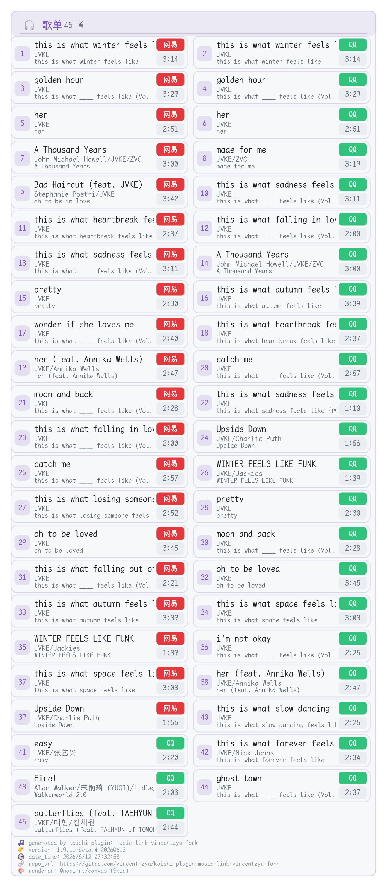
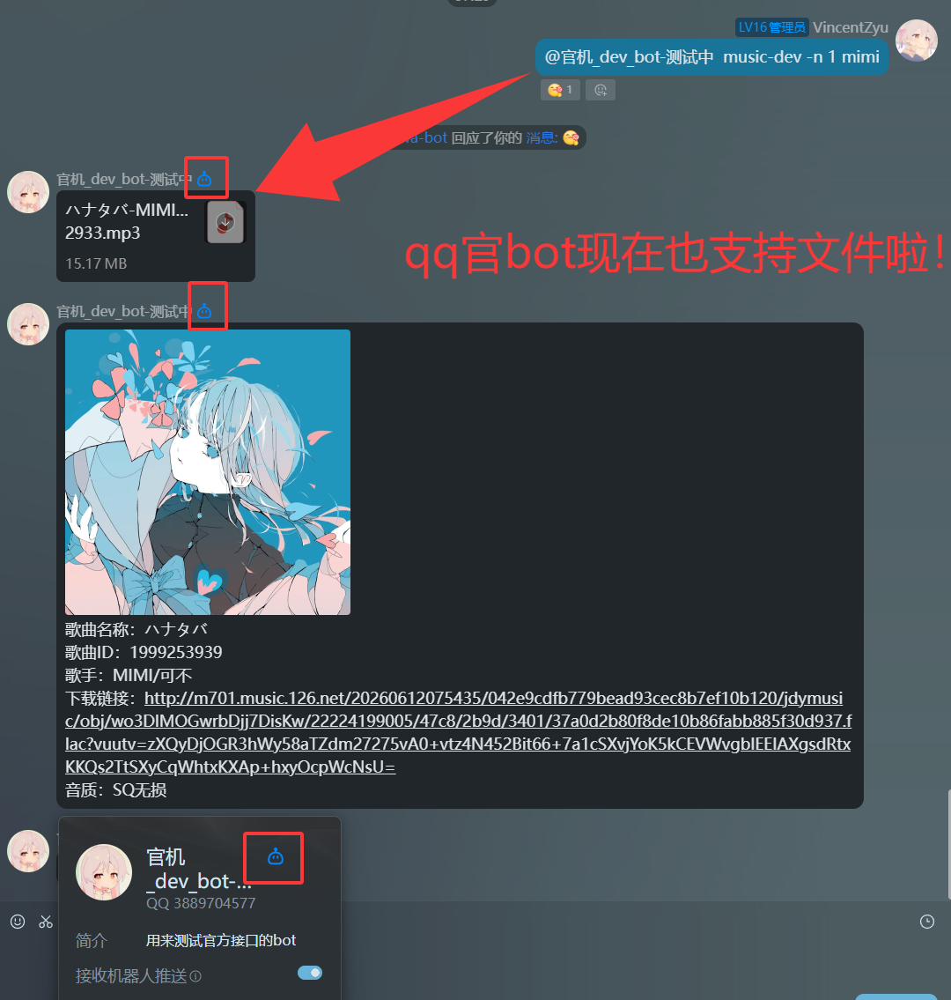

> **[📖 查看完整更新日志（含 fork 版本与上游版本历史）→](./changelog.md)**

# koishi-plugin-music-link-vincentzyu-fork

[](https://www.npmjs.com/package/koishi-plugin-music-link-vincentzyu-fork)
[](https://www.npmjs.com/package/koishi-plugin-music-link-vincentzyu-fork)

[](https://github.com/VincentZyuApps/koishi-plugin-music-link-vincentzyu-fork)
[](https://gitee.com/vincent-zyu/koishi-plugin-music-link-vincentzyu-fork)

[](https://forum.koishi.xyz/t/topic/12120)

[](https://qm.qq.com/q/4vjto4V7Di)

<p><del>💬 插件使用问题 / 🐛 Bug反馈 / 👨‍💻 插件开发交流，欢迎加入QQ群：<b>259248174</b>   🎉（这个群G了）</del></p> 
<p>💬 插件使用问题 / 🐛 Bug反馈 / 👨‍💻 插件开发交流，欢迎加入新QQ群：<b>1085190201</b> 🎉</p>
<p>💡 在群里直接艾特我，回复的更快哦~ ✨</p>

## 🔗 原始仓库
https://github.com/shangxueink/koishi-shangxue-apps/tree/main/plugins/music-link 
> 😅（66原作者怎么删了）

## 🏷️ fork 时上游版本
`1.7.30`

## 效果预览

### 🎨 Canvas 渲染模式 (v1.9.11+ 新增)

> ⚡ ** Canvas 渲染 [](https://github.com/Brooooooklyn/canvas) ** - 基于 `@napi-rs/canvas` / Skia 的轻量高速渲染方案
>
> - 🚀 **渲染很快**：整体出图速度通常明显快于 Puppeteer
> - 🪶 **更轻量**：不依赖浏览器进程，部署和运行成本更低
> - 🔍 **支持内部缩放**：可通过 `canvasScale` 提升清晰度
> - 🔤 **支持自定义字体**：可加载 `LXGW WenKai Mono` 等字体用于中文歌单渲染
>



### 🎨 SVG 渲染模式 (v1.9.0+ 新增)

> ✨ ** resvg 渲染 [](https://github.com/linebender/resvg)** -  基于 Rust 编写的高性能 SVG 渲染器，不依赖浏览器！
>
> - 🦀 **Rust 驱动**：使用 Rust 编写，内存安全，性能卓越
> - 💾 **低资源占用**：不依赖浏览器，内存和 CPU 占用极低
> - 🎨 **高清晰度**：支持高 DPI 缩放，输出图片清晰锐利
> - 🔧 **易于部署**：无需配置 Puppeteer 服务，开箱即用
>


### 🖌️ Puppeteer 渲染模式（传统方式）

> 🎭 ** Puppeteer 渲染 [](https://github.com/puppeteer/puppeteer) ** - 基于浏览器的传统渲染方式
>
> - 🎨 **样式更加精美**：支持更多复杂样式和特效
> - 📱 **兼容性更好**：基于标准浏览器渲染，支持更多 CSS 特性
> - 🔧 **可定制性强**：支持多种渲染样式和自定义字体
> - 📦 **功能丰富**：支持背景图片、模糊效果等高级特性
>
> ⚠️ **注意**：Puppeteer 渲染需要浏览器支持，内存占用较高
> - 内存资源充裕的机器可以选择此模式
> - 建议配置 Swap 以避免浏览器爆内存：[配置 Swap 指南](https://vincentzyu233.github.io/VincentZyu233/notes/system-config/swap.html)


### 💬 QQ Markdown 渲染模式（v1.9.6+ 新增）

> 💬 ** QQ Markdown 渲染 ** - 专为 QQ 平台优化的 Markdown 格式
>
> - 🎯 **仅支持 QQ 平台**：利用 QQ 官方 Markdown 消息能力
> - 📊 **两种显示风格**：支持表格风格和列表风格
> - 💡 **交互友好**：清晰的退出提示和选择指南
> - 🎨 **格式美观**：结构化布局，易于阅读


### 🐧 QQ 官 Bot 效果预览

> 📤 ** QQ 平台图文 / 语音 / 文件发送效果 ** - 展示官 QQ Bot 平台下的歌曲列表图片、音频与文件发送链路效果



-----

## 📋 以下为部分原始仓库 readme（修改过部分内容与格式）

# 🎵 koishi-plugin-music-link

🎵 **音乐下载** - 搜索并提供多个音乐平台的歌曲下载链接，🤩付费的也可以欸！？

## 特点

- **搜索歌曲**：🤩 支持QQ音乐、网易云音乐、酷狗音乐平台的歌曲搜索。
- **下载歌曲**：🎶 多个平台支持以不同音质下载歌曲，满足不同的音乐体验需求。提供免费以及付费音乐的下载链接。
- **歌曲详情**：🎧 获取包括音质、大小和下载链接在内的歌曲详细信息。
- **友好交互**：📱 简单易用的指令，快速获取你喜欢的音乐。

## 安装

🛒 在插件市场搜索并安装 `music-link-vincentzyu-fork`<br>
📦 在依赖管理右上角加号搜索 `koishi-plugin-music-link-vincentzyu-fork`<br>
📥 `cd` 到 Koishi 根目录后执行 `npm install koishi-plugin-music-link-vincentzyu-fork`<br>
🧶 `cd` 到 Koishi 根目录后执行 `yarn add koishi-plugin-music-link-vincentzyu-fork`<br>

### ⚠️ 重要：首次启动说明

插件首次启动时，会自动从 Gitee Realase 下载所需的资源文件（字体和背景图片），**下载完成后才会注册指令和启动中间件**。

#### 📢 Koishi WebUI 通知功能

插件启动时会在 Koishi WebUI 中显示配置信息和资源文件下载状态，方便用户了解插件运行情况。


如果网络不稳定或自动下载失败，可以手动下载资源文件：

**资源文件下载链接：**
- **字体文件：**
  - [LXGWWenKaiMono-Regular.ttf](https://gitee.com/vincent-zyu/koishi-plugin-music-link-vincentzyu-fork/releases/download/fonts/LXGWWenKaiMono-Regular.ttf)
  - [SourceHanSerifSC-Medium.otf](https://gitee.com/vincent-zyu/koishi-plugin-music-link-vincentzyu-fork/releases/download/fonts/SourceHanSerifSC-Medium.otf)

- **背景图片：**
  - [mahiro_mihari.png](https://gitee.com/vincent-zyu/koishi-plugin-music-link-vincentzyu-fork/releases/download/bg/mahiro_mihari.png)
  - [pixai_koishi.png](https://gitee.com/vincent-zyu/koishi-plugin-music-link-vincentzyu-fork/releases/download/bg_koishi/pixai_koishi.png)

**📥 手动下载步骤：**
1. 📥 点击上述链接下载资源文件
2. 📂 将所有文件放入 `assets` 文件夹（`assets` 文件夹与 `lib` 文件夹、`package.json` 文件位于同级目录中）
3. 🔄 重启本插件，让插件重新执行一遍 `validateAssets()`

---

## 📖 使用方法

安装并配置插件后，使用下述命令搜索和下载音乐：
> 指令名是可以改的，下面展示的`网易点歌`和`落月点歌`都是默认值捏

### 🎵 网易点歌 (command6)
```
网易点歌 [歌曲名称/歌曲ID]
```

**后端选择：**
- **`api.injahow.cn`** (默认 - 稳定推荐)
  - ✅ API请求快速且稳定，无需 puppeteer 服务
  - ✅ 推荐QQ官方机器人使用
  - ⚠️ VIP歌曲只能听45秒（黑胶限制）
  - 🎯 **仅支持网易云音乐**

- **`api.qijieya.cn`** (推荐 - 完整版)
  - ✅ 稳定性未知，但支持全部可听
  - ✅ 无VIP限制，完整歌曲
  - 🎯 **仅支持网易云音乐**

- **`meting.jmstrand.cn`** (可选)
  - ✅ 稳定性未知，全部可听
  - 🎯 **仅支持网易云音乐**

- **`metingapi.nanorocky.top`** (不推荐)
  - ✅ 无损音质，全部可听
  - ⚠️ 文件很大，下载慢
  - 🎯 **仅支持网易云音乐**

### 🎶 落月点歌 (command9)
```
落月点歌 [歌曲名称]
```

**后端选择：**
- **`api.vkeys.cn/v2`** (落月api官方)
  - ✅ 支持**网易云 + QQ音乐 + 酷狗音乐**
  - ✅ 支持多音质选择（标准音质 - Master/Hi-Res）
  - ✅ 支持按所选平台聚合搜索（多选即聚合）
  - 🎯 **网易云最高支持：超清母带 (Master)**
  - 🎯 **QQ音乐最高支持：臻品母带2.0**
  - 🎯 **酷狗最高支持：Hi-Res / SQ无损 / HQ高品质 / 标准音质**

- **`http://xwl.vincentzyu233.cn:51217`** (作者自建)
  - ✅ 是官方 `v2` API 的超集，兼容官方现有能力
  - ✅ 额外增加了酷狗音乐 API 等扩展能力
  - ⚠️ 如果挂了可以去QQ群：`1085190201` 艾特作者 `@VincentZyu`

**当前 `command9` 聚合搜索说明：**

- ✅ 配置项 `command9_platforms` 支持 `netease` / `tencent` / `kugou`
- ✅ 勾选一个平台时，为单平台搜索
- ✅ 勾选多个平台时，会并行请求后交替合并结果
- ⚠️ `command9_searchListLength` 在多平台模式下更像“目标总量参考值”，不是严格上限
- 📌 例如勾选 3 个平台并设置 `50` 时，当前实现会按每平台 `ceil(50 / 3) = 17` 请求，最终最多得到 `17 * 3 = 51` 条

**多平台数量分配公式：**

设：

- `Len` = 配置项 `command9_searchListLength`
- `n` = 当前勾选的平台数
- `m` = 每个平台实际请求的数量

则当前实现采用：

$$
m = \left\lceil \frac{Len}{n} \right\rceil
$$

其中 $\lceil x \rceil$ 表示“上取整”，即取大于等于 $x$ 的最小整数。

代入一个具体例子：

$$
Len = 50,\quad n = 3
$$

$$
m = \left\lceil \frac{50}{3} \right\rceil
  = \left\lceil 16.666\ldots \right\rceil
  = 17
$$

所以最多返回：

$$
n \cdot m = 3 \cdot 17 = 51
$$

**落月api音质等级说明：**

| 🎵 平台 | 🎛️ 音质选项 | 📊 码率/格式 |
|:---|:---|:---|
| 🎵 网易云 | 标准 | 64k / 128k |
| 🎵 网易云 | HQ 极高 | 192k / 320k |
| 🎵 网易云 | SQ 无损 | FLAC |
| 🎵 网易云 | Hi-Res | 高解析度无损 |
| 🎵 网易云 | Spatial Audio | 高清臻音 |
| 🎵 网易云 | Master | 超清母带 |
| 🎶 QQ音乐 | 标准/HQ | 标准/高音质 |
| 🎶 QQ音乐 | SQ 无损 | 无损音质 |
| 🎶 QQ音乐 | Hi-Res | Hi-Res 音质 |
| 🎶 QQ音乐 | 杜比全景声 | Dolby Atmos |
| 🎶 QQ音乐 | 臻品母带 2.0 | Master 2.0 |
| 🐶 酷狗音乐 | 标准音质 | 128 |
| 🐶 酷狗音乐 | HQ高品质 | 320 |
| 🐶 酷狗音乐 | SQ无损 | FLAC |
| 🐶 酷狗音乐 | Hi-Res | high |

> 💡 酷狗当前在插件里的可选质量参数为：`128`、`320`、`flac`、`high`
>
> ⚠️ 多平台聚合或酷狗模式下，当前更推荐“先搜索再选歌”；ID 直点场景没有像单平台网易云 / QQ 那样做完整直通适配。

---

<h3>🎯 如何返回语音 / 视频 / 群文件消息</h3>
<p>可以修改对应指令的<code>返回字段表</code>中的 <code>下载链接</code> 对应的 <code>字段发送类型</code> 字段，</p>
<p>把 <code>text</code> 更改为 <code>audio</code> ➜ 🔊 返回语音</p>
<p>改为 <code>video</code> ➜ 🎥 返回视频消息</p>
<p>改为 <code>file</code> ➜ 📁 返回群文件</p>
<hr>

<p>⚠️ 需要注意的是，当配置返回格式为音频/视频的时候，请自行检查是否安装了 <code>silk</code>、<code>ffmpeg</code> 等服务。</p>
<p>⚠️ 如果你选择了 <code>file</code> 类型，请确保平台支持！目前仅实测了 <code>onebot</code> 平台的部分协议端支持！</p>
<hr>

<h3>⚡ 使用 <code>-n 数字</code> 直接返回内容</h3>
<p>在使用命令时，可以通过添加 <code>-n 数字</code> 选项直接返回指定序号的歌曲内容。这对于快速获取特定歌曲非常有用。</p>
<p>📌 例如，使用以下命令可以直接获取第一首歌曲的详细信息：</p>
<pre><code>歌曲搜索 -n 1 蔚蓝档案</code></pre>


---


## ⚖️ 免责声明

1. ⚖️ **数据来源**：
   - 本插件调用了第三方网站（如 `music.gdstudio.xyz`）的接口来获取音乐资源。插件开发者不对这些第三方网站的内容、合法性或安全性负责。
   - 用户在使用本插件时，应自行承担因使用第三方服务而产生的任何风险。

2. 📜 **版权声明**：
   - 本插件提供的音乐资源可能受版权保护。用户应确保在使用这些资源时遵守相关法律法规。
   - 插件开发者不鼓励或支持任何侵犯版权的行为。用户应仅下载和使用已获得合法授权的音乐资源。

3. 🛡️ **插件用途**：
   - 本插件仅供学习和研究使用，禁止用于任何商业用途。
   - 插件开发者不对用户因使用本插件而产生的任何法律问题负责。

4. ⚠️ **服务稳定性**：
   - 由于依赖第三方服务，插件的功能可能会因第三方服务的变更或不可用而受到影响。
   - 插件开发者不保证插件的持续可用性或稳定性。

5. 👤 **用户责任**：
   - 用户在使用本插件时，应遵守相关法律法规和平台规定。
   - 如因用户不当使用本插件而导致任何问题，插件开发者不承担任何责任。

---

## 📋 更新日志

> **[📖 查看完整更新日志（含 fork 版本与上游版本历史）→](./changelog.md)**
