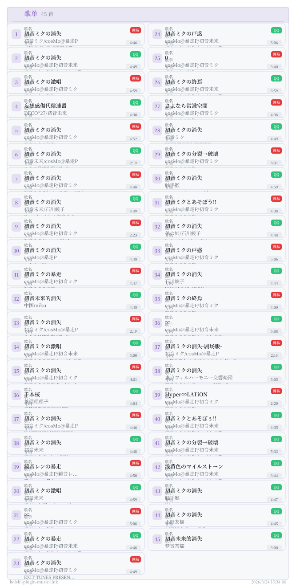
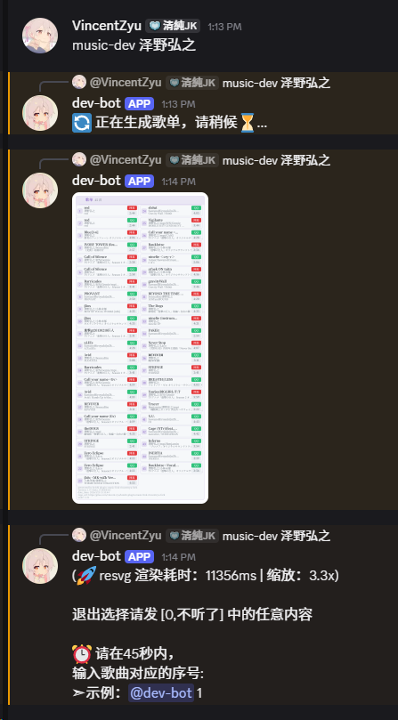
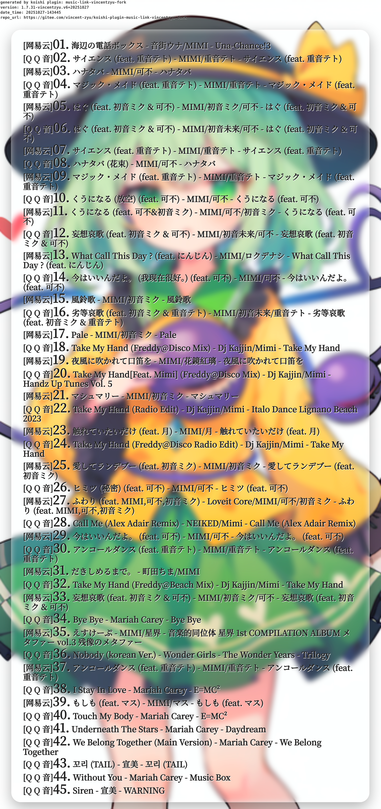
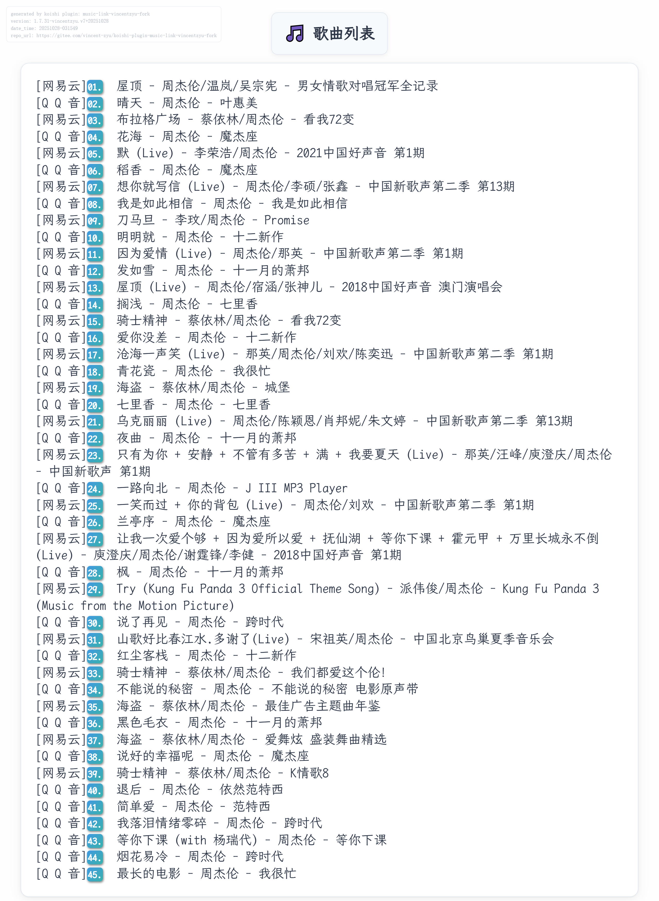
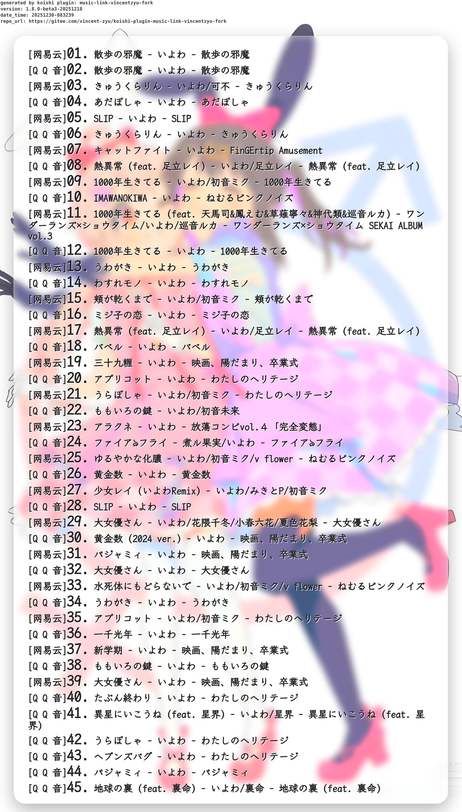
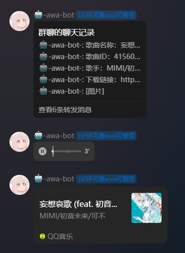
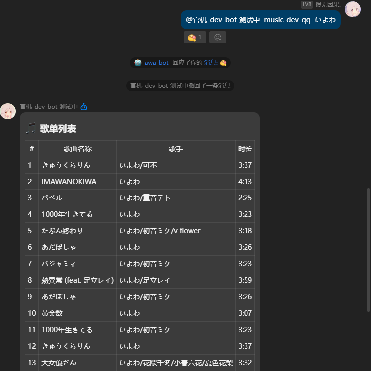
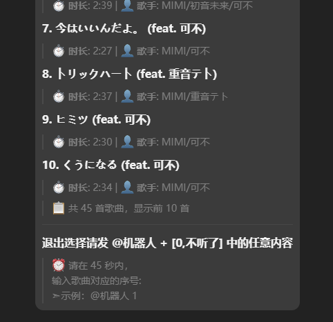
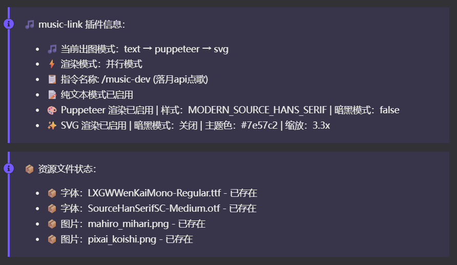

# koishi-plugin-music-link-vincentzyu-fork

[](https://www.npmjs.com/package/koishi-plugin-music-link-vincentzyu-fork)
[](https://www.npmjs.com/package/koishi-plugin-music-link-vincentzyu-fork)
[](https://github.com/VincentZyuApps/koishi-plugin-music-link-vincentzyu-fork)
[](https://gitee.com/vincent-zyu/koishi-plugin-music-link-vincentzyu-fork)
[](https://forum.koishi.xyz/t/topic/12120)
[](https://qm.qq.com/q/ZN7fxZ3qCq)

<p><del>💬 插件使用问题 / 🐛 Bug反馈 / 👨‍💻 插件开发交流，欢迎加入QQ群：<b>259248174</b>   🎉（这个群G了）</del></p> 
<p>💬 插件使用问题 / 🐛 Bug反馈 / 👨‍💻 插件开发交流，欢迎加入新QQ群：<b>1085190201</b> 🎉</p>
<p>💡 在群里直接艾特我，回复的更快哦~ ✨</p>

## 原始仓库：
https://github.com/shangxueink/koishi-shangxue-apps/tree/main/plugins/music-link 
> (66原作者怎么删了)

## fork此插件时候 上游仓库版本号:
`1.7.30`

## 效果预览

### 🎨 SVG 渲染模式 (v1.9.0+ 新增)

> ✨ ** resvg 渲染 [](https://github.com/linebender/resvg)** -  基于 Rust 编写的高性能 SVG 渲染器，不依赖浏览器！
>
> - 🦀 **Rust 驱动**：使用 Rust 编写，内存安全，性能卓越
> - 💾 **低资源占用**：不依赖浏览器，内存和 CPU 占用极低
> - 🎨 **高清晰度**：支持高 DPI 缩放，输出图片清晰锐利
> - 🔧 **易于部署**：无需配置 Puppeteer 服务，开箱即用
>





### 🖌️ Puppeteer 渲染模式（传统方式）

> 🎭 ** Puppeteer 渲染 [](https://github.com/puppeteer/puppeteer) ** - 基于浏览器的传统渲染方式
>
> - 🎨 **样式更加精美**：支持更多复杂样式和特效
> - 📱 **兼容性更好**：基于标准浏览器渲染，支持更多 CSS 特性
> - 🔧 **可定制性强**：支持多种渲染样式和自定义字体
> - 📦 **功能丰富**：支持背景图片、模糊效果等高级特性
>
> ⚠️ **注意**：Puppeteer 渲染需要浏览器支持，内存占用较高
> - 内存资源充裕的机器可以选择此模式
> - 建议配置 Swap 以避免浏览器爆内存：[配置 Swap 指南](https://vincentzyu233.github.io/VincentZyu233/notes/system-config/swap.html)






### 💬 QQ Markdown 渲染模式（v1.9.6+ 新增）

> 💬 ** QQ Markdown 渲染 ** - 专为 QQ 平台优化的 Markdown 格式
>
> - 🎯 **仅支持 QQ 平台**：利用 QQ 官方 Markdown 消息能力
> - 📊 **两种显示风格**：支持表格风格和列表风格
> - 💡 **交互友好**：清晰的退出提示和选择指南
> - 🎨 **格式美观**：结构化布局，易于阅读




-----
# 以下是修改过的部分的原始仓库的readme
# koishi-plugin-music-link

🎵 **音乐下载** - 搜索并提供QQ音乐和网易云音乐平台的歌曲下载链接，🤩付费的也可以欸！？

## 特点

- **搜索歌曲**：🤩 支持QQ音乐和网易云音乐平台的歌曲搜索。
- **下载歌曲**：🎶 QQ平台支持以不同音质下载歌曲，满足不同的音乐体验需求。提供免费以及付费音乐的下载链接。
- **歌曲详情**：🎧 获取包括音质、大小和下载链接在内的歌曲详细信息。
- **友好交互**：📱 简单易用的指令，快速获取你喜欢的音乐。

## 安装

在koishi插件市场 搜索并安装`music-link-vincentzyu-fork`<br>
或者 在koishi依赖管理 右上角加号 搜索`koishi-plugin-music-link-vincentzyu-fork`<br>
或者 `cd到你koishi的根目录` 然后 `npm install koishi-plugin-music-link-vincentzyu-fork`<br>
或者 `cd到你koishi的根目录` 然后 `yarn add koishi-plugin-music-link-vincentzyu-fork`<br>

### ⚠️ 重要：首次启动说明

插件首次启动时，会自动从 Gitee Realase 下载所需的资源文件（字体和背景图片），**下载完成后才会注册指令和启动中间件**。

#### 📢 Koishi WebUI 通知功能

插件启动时会在 Koishi WebUI 中显示配置信息和资源文件下载状态，方便用户了解插件运行情况。



如果网络不稳定或自动下载失败，可以手动下载资源文件：

**资源文件下载链接：**
- **字体文件：**
  - [LXGWWenKaiMono-Regular.ttf](https://gitee.com/vincent-zyu/koishi-plugin-music-link-vincentzyu-fork/releases/download/fonts/LXGWWenKaiMono-Regular.ttf)
  - [SourceHanSerifSC-Medium.otf](https://gitee.com/vincent-zyu/koishi-plugin-music-link-vincentzyu-fork/releases/download/fonts/SourceHanSerifSC-Medium.otf)

- **背景图片：**
  - [mahiro_mihari.png](https://gitee.com/vincent-zyu/koishi-plugin-music-link-vincentzyu-fork/releases/download/bg/mahiro_mihari.png)
  - [pixai_koishi.png](https://gitee.com/vincent-zyu/koishi-plugin-music-link-vincentzyu-fork/releases/download/bg_koishi/pixai_koishi.png)

**手动下载步骤：**
1. 点击上述链接下载资源文件
2. 将所有文件放入 `assets` 文件夹（`assets` 文件夹与 `lib` 文件夹、`package.json` 文件位于同级目录中）
3. 重启本插件，让插件重新执行一遍`validateAssets()`

---

## 📖 使用方法

安装并配置插件后，使用下述命令搜索和下载音乐：
> 指令名是可以改的，下面展示的`网易点歌`和`落月点歌`都是默认值捏

### 🎵 网易点歌 (command6)
```
网易点歌 [歌曲名称/歌曲ID]
```

**后端选择：**
- **`api.injahow.cn`** (默认 - 稳定推荐)
  - ✅ API请求快速且稳定，无需 puppeteer 服务
  - ✅ 推荐QQ官方机器人使用
  - ⚠️ VIP歌曲只能听45秒（黑胶限制）
  - 🎯 **仅支持网易云音乐**

- **`api.qijieya.cn`** (推荐 - 完整版)
  - ✅ 稳定性未知，但支持全部可听
  - ✅ 无VIP限制，完整歌曲
  - 🎯 **仅支持网易云音乐**

- **`meting.jmstrand.cn`** (可选)
  - ✅ 稳定性未知，全部可听
  - 🎯 **仅支持网易云音乐**

- **`metingapi.nanorocky.top`** (不推荐)
  - ✅ 无损音质，全部可听
  - ⚠️ 文件很大，下载慢
  - 🎯 **仅支持网易云音乐**

### 🎶 落月点歌 (command9)
```
落月点歌 [歌曲名称]
```

**后端选择：**
- **`api.vkeys.cn/v2`** (落月api官方)
  - ✅ 支持**网易云 + QQ音乐**
  - ✅ 支持多音质选择（64k - Master母带）
  - ✅ 支持聚合搜索（双平台同时搜索）
  - 🎯 **网易云最高支持：超清母带 (Master)**
  - 🎯 **QQ音乐最高支持：臻品母带2.0**

- **`http://xwl.vincentzyu233.cn:51217`** (作者自建)
  - ✅ 与官方API功能相同
  - ⚠️ 如果挂了可以去QQ群：259248174 叫我

**落月api音质等级说明：**

| 平台 | 音质选项 | 码率/格式 |
|:---|:---|:---|
| 网易云 | 标准 | 64k / 128k |
| 网易云 | HQ极高 | 192k / 320k |
| 网易云 | SQ无损 | FLAC |
| 网易云 | Hi-Res | 高解析度无损 |
| 网易云 | Spatial Audio | 高清臻音 |
| 网易云 | Master | 超清母带 |
| QQ音乐 | 标准/HQ | 标准/高音质 |
| QQ音乐 | SQ无损 | 无损音质 |
| QQ音乐 | Hi-Res | Hi-Res音质 |
| QQ音乐 | 杜比全景声 | Dolby Atmos |
| QQ音乐 | 臻品母带2.0 | Master 2.0 |

---

<h3>如何返回语音/视频/群文件消息</h3>
<p>可以修改对应指令的<code>返回字段表</code>中的 <code>下载链接</code> 对应的 <code>字段发送类型</code> 字段，

把 <code>text</code> 更改为 <code>audio</code> 就是返回 语音，

改为 <code>video</code> 就是返回 视频消息，

改为 <code>file</code> 就是返回 群文件。</p>
<hr>

<p>⚠️需要注意的是，当配置返回格式为音频/视频的时候，请自行检查是否安装了 <code>silk</code>、<code>ffmpeg</code> 等服务。</p>
<p>⚠️如果你选择了 <code>file</code> 类型，请确保平台支持！目前仅实测了 <code>onebot</code> 平台的部分协议端支持！</p>
<hr>

<h3>使用 <code>-n 数字</code> 直接返回内容</h3>
<p>在使用命令时，可以通过添加 <code>-n 数字</code> 选项直接返回指定序号的歌曲内容。这对于快速获取特定歌曲非常有用。</p>
<p>例如，使用以下命令可以直接获取第一首歌曲的详细信息：</p>
<pre><code>歌曲搜索 -n 1 蔚蓝档案</code></pre>


---


## 免责声明

1. **数据来源**：
   - 本插件调用了第三方网站（如 `music.gdstudio.xyz`）的接口来获取音乐资源。插件开发者不对这些第三方网站的内容、合法性或安全性负责。
   - 用户在使用本插件时，应自行承担因使用第三方服务而产生的任何风险。

2. **版权声明**：
   - 本插件提供的音乐资源可能受版权保护。用户应确保在使用这些资源时遵守相关法律法规。
   - 插件开发者不鼓励或支持任何侵犯版权的行为。用户应仅下载和使用已获得合法授权的音乐资源。

3. **插件用途**：
   - 本插件仅供学习和研究使用，禁止用于任何商业用途。
   - 插件开发者不对用户因使用本插件而产生的任何法律问题负责。

4. **服务稳定性**：
   - 由于依赖第三方服务，插件的功能可能会因第三方服务的变更或不可用而受到影响。
   - 插件开发者不保证插件的持续可用性或稳定性。

5. **用户责任**：
   - 用户在使用本插件时，应遵守相关法律法规和平台规定。
   - 如因用户不当使用本插件而导致任何问题，插件开发者不承担任何责任。

---

### fork仓库的更新日志

- **1.9.9-beta.3+20260411** 🎨
  - 🐛 **问题修复**
    - 修复 Puppeteer 原始黑白样式(ORIGIN_BLACK_WHITE)中 version info 与歌单内容重叠的问题
      • body padding-top增至120px，为顶部元素预留充足空间
      • version-info移至页面真正左上角(top: 8px)，z-index: 1000
      • header-bar下移至top: 60px，避免与version info重叠
      • 调整DOM顺序：versionInfoHtml置于header-bar之前
    - 修复截图区域问题：改为截取整个body而非仅#song-list元素

- **1.9.9-beta.2+20260411** 📦
  - 🔧 **代码重构**
    - 将测试相关文件从assets/迁移至test/目录
      • generate-test-data.py → test/
      • songlist-test.json → test/
    - 修正loadTestSongList函数中测试数据文件读取路径
  - 📝 **文档更新**
    - package.json新增test目录到files字段，确保发布时包含测试资源
    - 更新test/README.md使用说明，补充Python脚本执行命令

- **1.9.9-beta.1+20260411** 🚀
  - ✨ **新功能**
    - command6/command9 新增 `--test` 测试模式，仅展示歌单不进入选择流程
    - SVG渲染支持自定义字体配置(svgEnableCustomFont/svgFontFiles/svgFontFamilies)
    - SVG/Puppeteer渲染器增加版本信息显示开关(svgShowVersionInfo/puppeteerShowVersionInfo)
  - 🐛 **问题修复**
    - 修复Puppeteer渲染器重复生成HTML的性能问题，优化为单次渲染
    - 修复SVG渲染器中config变量未定义的ReferenceError
  - 🎨 **代码质量**
    - 统一代码缩进为4空格Tab，格式化所有源文件

- **1.9.7-beta.1+20260410** 🔍
  - ✨ **新增中间件白名单机制**
    - 新增Onebot音乐卡片JSON解析的白名单过滤功能
    - 支持自定义白名单规则（viewType + enabled配置）
    - 默认启用`music`类型（单曲卡片），禁用`news`类型（歌单/一起听等）
    - 可通过配置项`customWhitelist`灵活控制哪些卡片类型需要解析
  - ⚙️ **配置优化**
    - 新增`enableWhitelist`配置项控制是否启用白名单过滤
    - 新增`used_id`配置项设置歌单里默认选择的序号（范围0-10）
  - 🐛 **问题修复**
    - 重构渲染架构并全面优化代码结构
    - 新增lib/renderer-text.js文件，分离文本渲染逻辑
    - 重构并行/串行渲染模式，确保严格按照配置表顺序执行消息发送
    - 修复QQ平台无法连续发送多个markdown歌单的问题（增加msg_seq参数）
    - QQ Markdown模式新增renderInfo信息显示（版本、时间、仓库链接等）
  - 📝 **日志系统增强**
    - 资源下载流程：添加emoji标识和结构化日志
    - 缓存目录管理：增强路径验证，区分文件/目录类型
    - 文件下载监控：添加耗时统计、文件大小显示、超时提醒
    - 音乐卡片发送：优化日志输出格式，便于调试和问题追踪
  - 🎨 **代码质量提升**
    - 优化整体代码格式和注释规范
    - 统一日志输出风格，使用emoji增强可读性
    - 增强类型定义文件(lib/index.d.ts)
    - 清理冗余代码和测试数据
  - 📖 **论坛发布的markdown**：[查看1.9.7 OneBot音乐卡片白名单功能详解](doc/koishi论坛的更新日志捏/1.9.7更新了解析onebot音乐卡片的白名单.md)

- **1.9.6-beta.4+20260330** 📝
  - ✨ **QQ Markdown功能完善**
    - 新增QQ平台Markdown渲染模式预览图片
    - 更新README.md文档，添加QQ Markdown模式说明
    - 优化render-qq-markdown.js渲染逻辑
    - 新增Koishi WebUI通知功能预览图片

- **1.9.6-beta.3+20260330** 🚀
  - ✨ **新增QQ平台Markdown发送能力**
    - 适配command6和command9命令支持QQ Markdown发送
    - 优化相关命令和渲染逻辑
    - 为正式发版做准备

- **1.9.6-beta.2+20260329** 🐛
  - 🐛 **问题修复**
    - 修复QQ Markdown模式下歌手信息不显示的问题
  - ⚙️ **配置优化**
    - 新增markdownTableMaxDisplay配置（默认20首）
    - 新增markdownStyleMaxDisplay配置（默认10首）
    - 移除旧的markdownMaxDisplay配置项

- **1.9.5-beta.1+20260329** 🚀
  - ✨ **功能优化**
    - 歌单列表显示格式优化：歌曲编号从 `1. 歌曲名` 改为 `(1) 歌曲名`，更清晰易读
    - 尝试修复智能制表符对齐功能：然而并没有成功qwq
  - 🐛 **问题修复**
    - 修复 command6 搜索结果缺少平台标识的问题，现在会正确显示 `网易`的红色的 小圆角矩形tag~
  - 💡 **文案优化**
    - 将"出图模式"更名为"消息渲染模式"，描述更加准确
    - 更新部分后端 API 描述文案

- **1.9.4-beta.1+20260329** 🎉
  - 🔧 **代码重构**
    - 拆分 index.js 为多个模块文件（middleware.js, command6.js, command9.js）
  - ✨ **新增 notifier 通知**
    - 插件启动时在 WebUI 显示配置信息
    - 显示资源文件（字体/图片）下载状态
  - 🎨 **界面优化**
    - 添加字体使用声明和插件许可声明（MIT）
  - 🐛 **Bug 修复**
    - 修复重复插件检测问题
    - 修复序号输入错误 bug
    - 修复私聊音乐卡片发送失败

- **1.9.1-beta.1+20260325** 🚀
  - 🔧 **统一渲染器行为**
    - 将 SVG 的 renderInfo 判断逻辑移至内部，与 Puppeteer 保持一致
    - 简化 `render.js` 逻辑，移除冗余判断
  - 🎨 **优化 SVG 布局**
    - 右侧标签整体右移，提升视觉效果
    - 左侧文字长度增加 2-3 个字符，减少省略号出现
  - 🌙 **配置项重命名**
    - 将 `darkMode` 改名为 `enablePuppeteerDarkMode`，命名更清晰
  - 📝 **指令参数增强**
    - 为 `command6` 和 `command9` 添加 `--mode` 参数
    - 支持 `light` / `dark` / `白天` / `黑夜` 选项
    - 优先级：命令行参数 > 配置项默认值
  - ⚠️ **配置提示优化**
    - 为 `svgWidth` 和 `svgColumns` 添加警告信息
    - 提醒用户调整列数和宽度可能导致格式混乱
  - 📦 **版本更新**
    - 升级到 v1.9.1-beta.1+20260325

- **1.9.0-beta.1+20260324** 🎉
  - ✨ **新增 [](https://github.com/linebender/resvg) resvg 轻量级 SVG 渲染功能！**
    - 🦀 **基于 Rust 编写**：内存安全，性能卓越
    - 🚀 **比 Puppeteer 资源占用低！**（某些情况下 可能渲染还会更快捏）
    - 💾 **不依赖浏览器**：内存和 CPU 占用极低
    - 🔧 **易于部署**：无需配置 Puppeteer 服务
    - 📦 引入 `@resvg/resvg-js` 依赖，Puppeteer 依旧保持可选依赖
  - 🎨 **新增出图模式多选配置**
    - 📊 `renderMode` 配置项支持多选：`svg` / `puppeteer` / `text`
    - ✅ 默认只启用 SVG 模式，用户可根据需求自由组合
  - 🌙 **SVG 暗黑模式支持**
    - `enableSvgDarkMode` 配置项，默认亮色模式
    - 可自定义主题色 `svgThemeColor`（默认 Koishi 紫 #7e57c2）
    - 可调整渲染缩放比例 `svgScale`（默认 3.3x）
  - 📝 **配置智能提示**
    - 插件启动时自动显示当前出图模式配置
    - Puppeteer 配置项在未启用时自动禁用
  - 📖 **详细文档**：[查看1.9.0 SVG渲染功能详解](doc/koishi论坛的更新日志捏/1.9.x更新了svg出图捏.md)

- **1.8.2-beta.1+20260310**
  - fix: 修复 command6 ID 点歌模式中 `selectedSongId` 未定义的致命 bug（此 bug 导致 ID 点歌功能完全不可用）
  - fix: 修复 `generateResponse()` 中无条件发送音乐卡片，导致 command9 调用时重复/误发的问题
  - fix: 移除 `global._musicPlugin*` 全局变量污染，修复与 `reusable: true` 多实例声明的矛盾
  - refactor: 提取 `buildSongUrl()` / `smartGet()` / `fetchNeteaseLyric()` / `safeJsonParse()` 等辅助函数，大幅减少重复代码
  - refactor(render): 字体和图片文件改为模块级缓存，避免每次渲染重读大文件阻塞事件循环
  - refactor(render): puppeteer page 加 `try/finally` 防止内存泄漏
  - chore: homepage/bugs 迁移至 GitHub

- **1.8.1+20260310**
  - chore: 更新反馈群号为 1085190201（旧群 259248174 已失效）
  - release: 正式发版 🎉

- **1.8.1-beta2+20260207**
  - feat: 新增 `fileNameKeepSpaces` 配置项，支持保留文件名中的空格
  - feat: 新增 `fileNameSlashReplacement` 配置项，支持自定义文件名中斜杠`/`的替换字符（如 `-`、`&`、`_` 等）
  > 上面两项是神秘用户的要求，不过建议保持不变就好了捏，横杠`-`不是挺好的吗(
  - fix: `deleteTempTime` 配置项现在description里面写明支持设置为 `0` 或负数，表示永不删除临时文件 *(之前就支持，只是原作者没在description里面写)*
  - pref: `maxDuration` 默认值从 900 秒调整为 1800 秒
  - chore: 移除部分配置项的 `.experimental()` 标记，这些功能已经稳定

- **1.8.1-beta1-20260127**
  - feat: 新增支持base64发文件，适用于使用napcat docker的用户，就不需要配置--volume参数挂在temp文件夹了(
  - feat: 新增支持自定义文件名格式, 比如`${name}-${artist}-${time}.mp3`
  - refractor: 把 上游神人作者 搞的2000多行的index.js拆成了多个js文件方便后续维护
  - pref: 修改部分配置项默认值比如deleteTempTime是300s，防止音乐文件过大还没传完就删了
  - chore: addCoverInImage这个选项其实我一直都没做，原先是自用插件。这个配置项是提醒自己未来可以添加的。后面朋友想要我发版，而我发版之前忘记把这个删了。所以本次更新把这个选项改成默认值false并且disable掉

- **1.8.0-beta1-20251218**
  - 落月api新增自定义url
  - 换一个版本号方式，之前的太奇怪了((

- **1.7.31-vincentzyu.v6+20251027**
  - 支持发送onebot音乐卡片
  - 新增落月apiV2， powered by `api.vkeys.cn`，支持qq音乐、网易云 以及 二者聚合

- **1.7.31-vincentzyu.v7+20251028**
  - 新增html渲染模板：FLAT_MODERN
  - 支持自定义字体，在配置项中填入字体路径即可
  - 更新readme.md

- **1.7.31-vincentzyu.v4+20250923**
  - 到目前为止，fork以后的所有改动:
    - 只保留command6和8，其他全删了，因为貌似apiG了((
    - 提供两种渲染图片样式

- **前面的版本号**
  - 忘了
    - 反正你看到的features都是上游作者和我前面更新的(

---

### 上游仓库的更新日志

- **1.7.23**：
  - 添加`网易点歌`的最大时长限制
  - 支持qq官方平台机器人发送下载链接

- **1.7.20**：
  - 优化`generateResponse`调用方法
  - 修复command5的无下载链接的歌曲导致的无限等待
  - 新增合并转发模式 仅支持onebot平台
  - 优化项目说明

- **1.7.17**：
  - 感谢`https://github.com/Onimaimai/nonebot-plugin-voicemusic/issues/10`提及的的API捏
  - 感谢`www.byfuns.top`
  - 新增网易点歌的直链获取后端。再也不是黑胶只能30秒啦~

- **1.7.16**：
  - 取消龙珠点歌的QQ音乐API调用
  - 优化command8的传参和本地化使用
  - 修改readme内容

- **1.7.15**：
  - 优化部分配置项说明
  - 整理优化结构
  - 声明支持多份配置
  - 为保持配置项统一稳定和简洁，暂不支持在同一个配置里 同时选择多个后端 注册多个指令
  - 修复`music.gdstudio.xyz`平台多弹窗的提示问题
  - 完善指令说明
  - 优化所有指令的具体实现
  - 通测确保正常
  - 取消字段的.hidden()
  - 优化说明内容

- **1.7.14**：
  - 优化command6的请求逻辑
  - 使用更加稳定的网易云官方API
  - 优化封面返回清晰度
  - 仍然使用原来的后端作为语音后端
  - 优化使用说明
  - 优化本地化对指令的描述
  - 优化项目说明内容，新增对file类型的提示

- **1.7.13**：
  - 优化command5等待逻辑
  - 修复command5QQ平台无限等待的bug
  - 完善匹配`没有找到相关的歌曲，请尝试更换关键词或平台。`的情况

- **1.7.12**：
  - 优化之后感觉`music.gdstudio.xyz`最好用
  - 修改默认后端
  - 优化说明内容
  - 优化`music.gdstudio.xyz`监听
  - 优化等待时机
  - 优化匹配内容
  - 优化返回
  - ...

- **1.7.9**：
  - 优化`music.gdstudio.xyz`的点歌逻辑
  - 改为网络监听而不是操作元素
  - 优化说明内容
  - 优化`music.gdstudio.xyz`菜单渲染逻辑
  - 修改`formatSongList`优化参数+1，允许自定义结束ID
  - 优化超时定时器的设置
  - 交互逻辑放到page.on的外面

- **1.7.7**：
  - 增加龙珠API
  - 修复音质指定的bug
  - 修复中间件解析的command8的网易云卡片解析id比预期-10
  - 完善说明
  - 修改部分，忘了

- **1.7.2**：
  - 优化配置项结构
  - 修改网易云ID点歌，改为搜索点歌
  - 优化配置项说明内容
  - 完善说明内容
  - 新增【选择使用的后端】
  - 优化command6对-n选项的支持

- **1.6.15**：
  - 兼容QQ音乐新格式的卡片
  - 加强判断，优化小黑盒卡片判断
  - 修复网易云ID点歌的include报错
  - 修复【歌曲搜索】网页因为经验条的报错
  - 取消部分日志输出，改为调试模式输出

- **1.6.10**：
  - 修复 command7 的数据持续监听逻辑问题（不关闭puppeteer）
  - 定位temp删不掉的问题（发现是onebot协议端 发不出去 retcode200，但是资源占用）

- **1.6.9**：
  - 新增`音乐搜索器`点歌，支持酷狗+网易云（江苏好像不好访问，会江苏反诈）
  - 优化temp删除逻辑
  - 优化中间件解析，新增command6 的解析功能
  - 修复父级指令消失


- **1.6.7**：
  - 优化temp删除逻辑
  - 按照指令层级注册指令

- **1.6.6**：
  - 换key不能解决用完的问题，需要用户自己去申请
  - 新增网易云ID单曲点歌——command6
  - 新增file返回类型，支持temp保存，和定时删除
  - 修复 command5 截图元素获取不到大小的问题
  - 修复部分说明内容
  - 完善配置项类型选择的说明

- **1.6.2**：
  - 更换APIKEY
  - 修复中间件监听解析对于command5的支持

- **1.6.1**：本地化支持
- **1.6.0**：新增对第三方网站 `music.gdstudio.xyz` 的支持，优化用户体验。
- **1.5.10**：往期更新。